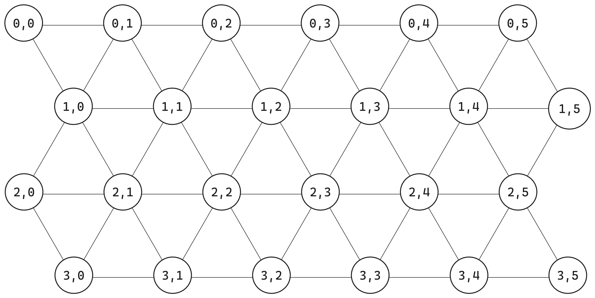

# IQ Rings Game

## Поле



Стандартное поле из оригинальной игры

```json
{
    "rows": 4,
    "columns": 6,
    "disabled": [] // выключаемые "клетки" (y, x) для не "прямоугольных" полей
}
```

## Деталь

```json
{
    "name": "00", // в будущем a-b-h4-s
    "state": { // правильное (или текущее) положение детали на поле
        "position": [1, 5], // в порядке Y, X
        "rotation": 4,
        "isFrontSide": false // перевернута/отражена ли деталь относительно оси X
    },
    "form": {
        "angle": "acute",
        "elements": {
            "left": {"type": "ball"},
            "center": {"type": "holey", "holes": [4]},
            "right": {"type": "solid"}
        }
    }
},
```

Поля `state.rotation` и `form.elements.{part}.holes[i]` принимают значения от 0 до 5.

Из формы `form` однозначно выводится тип соединений между деталями

- длина: short, medium или long
- поворот: число от 0 до 5


## Рассчет поворта

- Если число на схеме `R`, а угол поворота по часовой в градусах `A`, то `R = A / 60`
- Если деталь флипнута (`isFrontSide = alse`), сначала делается флип стандартного положения (относительно оси X), а потом высчитывается поворот